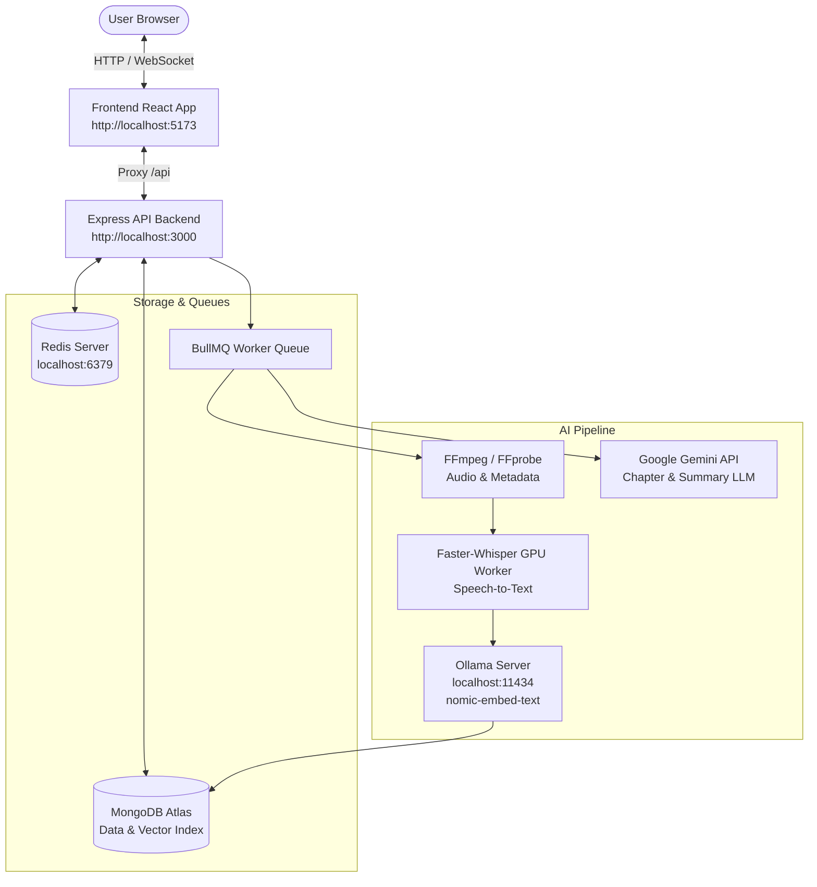

# AI Video Platform — Semantic Video Search & RAG

> An enterprise-grade AI video processing platform featuring automated speech-to-text transcription, semantic chunking, MongoDB Atlas Vector Search, Gemini LLM chapter generation, and an interactive video studio.

---

## 📌 1. Project Overview

**VideoRAG Studio** is a full-stack Retrieval-Augmented Generation (RAG) platform for video collections. It processes raw video files by extracting audio, transcribing speech locally with GPU acceleration, partitioning content into semantic segments, generating vector embeddings, and indexing them in MongoDB Atlas Vector Search. Users can perform natural language queries to jump directly to exact video timestamps, read AI-generated summaries and structured chapters, and interact with an AI Help Assistant.

---

## 🚀 2. Key Features

- **Video Upload & Ingestion**: Drag-and-drop video upload with format validation and automated thumbnail extraction.
- **Local Speech-to-Text**: GPU-accelerated transcription using Faster-Whisper (`Xenova/whisper-base`) offloaded to background worker threads.
- **Transcript Cleaning**: Rule-based text normalization, noise reduction, and timestamp alignment.
- **Semantic Chunking**: Context-aware content splitting based on token boundaries and semantic breaks.
- **Ollama Vector Embeddings**: Local high-dimensional embedding generation using `nomic-embed-text` (768 dimensions).
- **MongoDB Atlas Vector Search**: Cosine-similarity vector search for instant natural language query-to-timestamp retrieval.
- **Gemini AI Intelligence**: Automated chapter generation, video summarization, and keyword extraction powered by Google Gemini 3.5 Flash.
- **Interactive Studio Player**: Dual-pane interface with synced video playback, interactive transcript seeking, and chapter breakdown.
- **AI Help Chatbot**: Embedded assistant for platform guidance and troubleshooting.
- **Real-Time Analytics & Monitoring**: Dashboard KPI metrics, queue progress monitoring, and system activity tracking.

---

## 🏗️ 3. Architecture



---

## 🛠️ 4. Technology Stack

### Frontend
- **Framework**: React 19 + Vite 5
- **Styling**: Tailwind CSS + Lucide React Icons
- **State Management**: Zustand
- **Animations & UI**: Framer Motion, Recharts

### Backend
- **Runtime**: Node.js v22+ (TypeScript)
- **Framework**: Express 4
- **Task Queue**: BullMQ + Redis 7
- **Logging & Security**: Winston, Helmet, CORS, Express Rate Limit

### AI & NLP Pipeline
- **Speech Recognition**: Faster-Whisper (`@xenova/transformers`) with ONNX Worker Threads
- **Vector Embeddings**: Ollama (`nomic-embed-text`, 768-dim)
- **LLM Intelligence**: Google Gemini 3.5 Flash (`@google/generative-ai` REST API)

### Database & Storage
- **Database**: MongoDB Atlas
- **Vector Engine**: Atlas Vector Search (`vector_index`, Cosine Similarity)

### Hardware Acceleration
- **GPU Engine**: NVIDIA CUDA 12.7 (RTX 3050 Laptop GPU tested)
- **Media Processing**: FFmpeg 9.0 & FFprobe 9.0

---

## 📁 5. Project Structure

```
vedio_semantic_search/
├── apps/
│   ├── backend/
│   │   ├── src/
│   │   │   ├── api/
│   │   │   │   ├── controllers/      # Route controllers (Lectures, Search, Dashboard, Assistant)
│   │   │   │   └── routes/           # Express API route declarations
│   │   │   ├── config/               # App configuration & DB connection manager
│   │   │   ├── errors/               # Standardized error hierarchy
│   │   │   ├── interfaces/           # TypeScript contracts and types
│   │   │   ├── models/               # Mongoose schemas (Lecture, Chunk, ProcessingJob, Event)
│   │   │   ├── pipeline/             # Pipeline orchestrator
│   │   │   ├── providers/            # Strategy providers (Gemini, Ollama, Faster-Whisper)
│   │   │   ├── services/             # Core business logic services
│   │   │   ├── utils/                # Logging, response formatters, Redis connectors
│   │   │   ├── workers/              # BullMQ queue processors & Worker Threads
│   │   │   └── index.ts              # Server bootstrap entry point
│   │   ├── tsconfig.json
│   │   └── package.json
│   │
│   └── frontend/
│       ├── src/
│       │   ├── components/           # Reusable UI components (Player, Transcript, Charts)
│       │   ├── layouts/              # Main application layout wrapper
│       │   ├── pages/                # Route pages (Dashboard, Upload, Library, Studio, Search, Settings)
│       │   ├── services/             # Axios API service handlers
│       │   ├── main.jsx              # React app entry point
│       │   └── index.css             # Tailwind & base styles
│       ├── vite.config.js
│       └── package.json
│
├── docs/                             # Extended technical documentation
│   ├── ARCHITECTURE.md
│   ├── SETUP.md
│   ├── API.md
│   └── TROUBLESHOOTING.md
│
├── uploads/                          # Local runtime uploads (git-ignored)
│   └── videos/
├── .env.example                      # Configuration template
├── .gitignore                        # Git exclusion rules
├── docker-compose.yml                # Optional local service setup
├── package.json                      # Monorepo workspace configuration
└── README.md
```

---

## ⚙️ 6. Installation & Quick Start

### Prerequisites
- **Node.js**: `v20.0.0` or higher
- **npm**: `v10.0.0` or higher
- **Python**: `3.10+` (optional, for native faster-whisper bindings)
- **Docker**: Docker Desktop (for Redis container)
- **Ollama**: Installed and running locally
- **FFmpeg & FFprobe**: Installed and added to system PATH

---

### Step 1: Clone & Install Dependencies

```bash
git clone https://github.com/your-username/vedio_semantic_search.git
cd vedio_semantic_search

# Install monorepo dependencies
npm install
```

---

### Step 2: Environment Configuration

Create a `.env` file in the root directory by copying `.env.example`:

```bash
cp .env.example .env
```

Configure your credentials in `.env`:

```env
# MongoDB Atlas
MONGODB_URI=mongodb+srv://<username>:<password>@<cluster-url>/semantic_video_search?appName=VideoRAG-Studio

# Gemini API Key
GEMINI_API_KEY=your_gemini_api_key_here
GEMINI_MODEL=gemini-3.5-flash

# Ollama Embedding Config
OLLAMA_BASE_URL=http://localhost:11434
OLLAMA_EMBEDDING_MODEL=nomic-embed-text

# Redis Server
REDIS_URL=redis://localhost:6379
```

---

### Step 3: Start Infrastructure Services

#### 1. Redis Container
```bash
docker run -d --name redis-server -p 6379:6379 redis:7-alpine
```

#### 2. Pull Ollama Embedding Model
```bash
ollama pull nomic-embed-text
```

---

### Step 4: Run Application Services

```bash
# Start Backend Express Server & BullMQ Worker
npm --prefix apps/backend run dev

# Start Frontend React App (in a separate terminal)
npm --prefix apps/frontend run dev
```

* **Frontend Application**: `http://localhost:5173`
* **Backend API Server**: `http://localhost:3000`

---

## 🔍 7. MongoDB Atlas Vector Search Setup

To enable natural language timestamp search, create a **Vector Search Index** on the `chunks` collection in MongoDB Atlas:

* **Collection Name**: `chunks`
* **Index Name**: `vector_index`
* **JSON Definition**:

```json
{
  "fields": [
    {
      "type": "vector",
      "path": "embedding",
      "numDimensions": 768,
      "similarity": "cosine"
    },
    {
      "type": "filter",
      "path": "lectureId"
    }
  ]
}
```

---

## 🖥️ 8. GPU & Hardware Acceleration Setup

* **NVIDIA CUDA**: Tested with CUDA 12.7 and NVIDIA GeForce RTX 3050 Laptop GPU.
* **Worker Isolation**: The audio transcription pipeline delegates Heavy ONNX models to Node.js `worker_threads` to prevent blocking the Express main HTTP event loop.

---

## 📡 9. API Reference Summary

| Method | Endpoint | Description |
| :--- | :--- | :--- |
| `GET` | `/ping` | Health check endpoint |
| `GET` | `/health` | Detailed service health status |
| `GET` | `/api/dashboard/stats?userId=:id` | Fetch dashboard analytics and KPIs |
| `POST` | `/api/lectures` | Upload new video for processing |
| `GET` | `/api/lectures` | List all processed videos |
| `GET` | `/api/lectures/:id` | Fetch single video details with transcript & chapters |
| `POST` | `/api/search` | Natural language vector search across video chunks |
| `POST` | `/api/assistant/chat` | Interact with AI Help Assistant |

---

## 🚦 10. Application Routes

- `/dashboard` — KPI stats, recent activities, storage metrics, upload trends.
- `/upload` — Drag-and-drop lecture file uploader.
- `/library` — Video library overview and search filters.
- `/processing` — Live status of ongoing video processing pipeline.
- `/studio` — Interactive player, synced transcripts, chapters, and summary.
- `/search` — Vector search console targeting video timestamps.
- `/settings` — System parameters, provider configurations, and pipeline rules.

---

## 🔧 11. Troubleshooting

- **Redis Connection Refused**: Verify container is up (`docker ps`) on port `6379`.
- **MongoDB Atlas ServerSelectionError**: Ensure your local IP address is whitelisted under Atlas Network Access.
- **Gemini 429 Quota Exceeded**: Free-tier rate limits reached. Update `GEMINI_API_KEY` in `.env` and restart backend.
- **Dashboard Spinning Loading State**: Ensure backend is started (`npm --prefix apps/backend run dev`) and MongoDB Atlas is reachable.

---

## 🔒 12. Security Guidelines

- **Never commit `.env`**: Always ensure `.env` is listed in `.gitignore`.
- **Placeholder Values**: Keep `.env.example` safe with placeholder strings only.
- **CORS & Rate Limiting**: Production setup must enforce restricted CORS origins and rate limits.

---

## 📜 13. License

This project is licensed under the **MIT License**.
